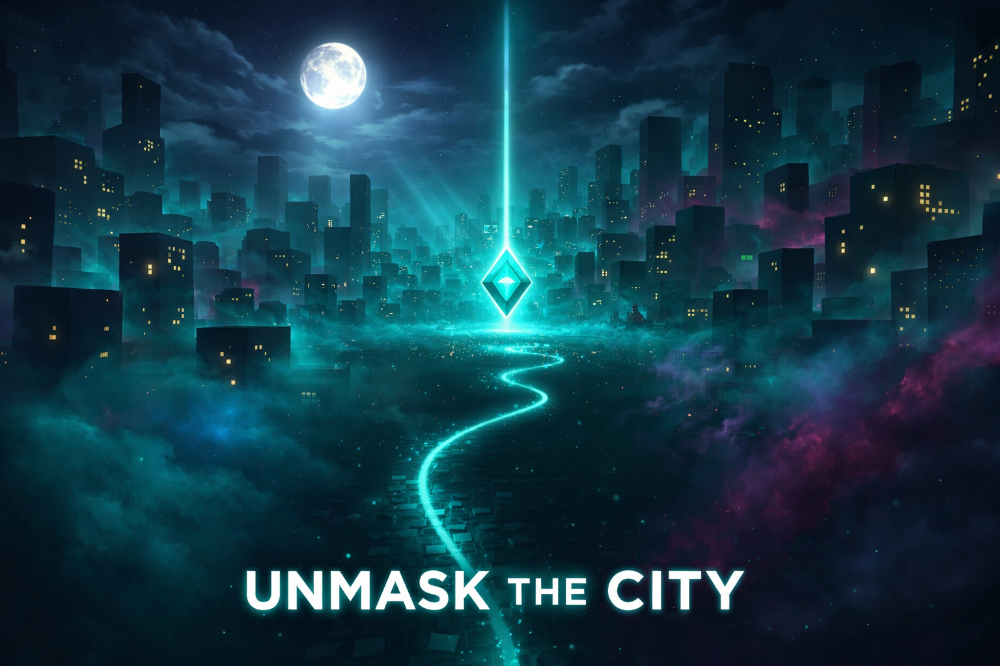

# Unmask the City



[](https://threejs.org/)
[](https://www.typescriptlang.org/)
[](https://vitejs.dev/)
[](LICENSE)
[](https://globalgamejam.org/)

> A 3D exploration game for Global Game Jam 2026 | Theme: **Mask**

**[🎮 Play the Game](https://furic.github.io/unmask-the-city/)** | [🎲 GGJ Page](https://globalgamejam.org/games/2026/unmask-city-4) | [📖 Technical Docs](TECH_STACK.md) | [🗺️ Development Plan](PLAN.md)

## Concept

Navigate through a fog-covered procedural city, revealing the world as you explore. The city has been consumed by a malevolent fog, hiding its streets and buildings beneath an impenetrable shroud. You are the last hope - collect ancient fragments of light to pierce through the darkness and unmask the city.

## Gameplay

- **Explore**: Navigate a procedurally generated city shrouded in mysterious fog
- **Reveal**: Your presence permanently clears the fog, revealing the city's secrets
- **Collect**: Find all fragments of light (5 on Easy, 7 on Normal, 10 on Hard)
- **Score**: Compete for the best time, exploration %, and bonus points
- **Dynamic Atmosphere**: Experience automatic day/night cycles with four unique visual themes

## Controls

- `WASD` / Arrow Keys - Move
- `Mouse` - Look around
- `Shift` - Sprint (drains stamina, regenerates faster in parks)
- `Ctrl` + Sprint - Slide for extra speed
- `Space` - Jump
- `Esc` - Pause / Resume
- `M` - Mute/unmute audio
- `P` - Take screenshot (saved to downloads)

## Features

### Core Mechanics
- First-person exploration with smooth movement and head bobbing
- Procedurally generated city with 300+ unique buildings
- Fog of war system that permanently reveals explored areas
- Stamina system with 2x faster regeneration in parks
- Three difficulty levels (Easy, Normal, Hard)

### Visual Effects
- Automatic day/night cycle (Day → Dusk → Night → Neon)
- Animated clouds, birds during day, bats at night
- Dynamic particle systems: leaves in parks, steam vents, embers in corrupted fog
- Fragment collection effects: particle burst, color tint, slow-motion
- Continuous fireworks during win sequence
- Moon with atmospheric lighting
- Building sway animation for tall skyscrapers
- Seasonal tree variations (Spring, Summer, Autumn, Winter)
- Breadcrumb trail showing your exploration path

### Audio Design
- Surface-specific footsteps (concrete, grass, water)
- Echo/reverb effects near tall buildings
- Distance-based wind (louder in open areas)
- Water ambience near lakes
- Distant traffic rumble
- Night creature sounds (crickets, owls)
- Fragment type-specific collection sounds
- Milestone chimes (3/7, 5/7 collected)
- Thunder effects during lightning

### Scoring System
- Base score: Time + Exploration %
- Speed Bonus: Collect 2 fragments within 15 seconds (+500)
- Perfect Explorer: Collect all fragments + 90% explored (+2000)
- No Pause Bonus: Complete without pausing (+1000)
- Time Trial: Complete under 3 minutes on Normal (+1500)

### UI/UX
- Professional start screen with live 3D preview
- Loading screen with animated tips
- Game info modal with story and controls
- Local leaderboard tracking (per difficulty)
- Compass pointing to nearest fragment
- Real-time stamina bar and mini-map

## Tech Stack

- **Three.js** v0.170.0 - 3D rendering with WebGL
- **TypeScript** - Type-safe game logic
- **Vite** - Lightning-fast dev server & optimized builds
- **Web Audio API** - Procedural sound generation

## Getting Started

```bash
# Install dependencies
npm install

# Run dev server
npm run dev

# Build for production
npm run build
```

## Project Structure

```
unmask-the-city/
├── src/
│   ├── main.ts              # Entry point, difficulty settings, leaderboard
│   ├── game/
│   │   ├── Game.ts          # Main game orchestrator & animation loop
│   │   ├── Player.ts        # First-person controller with parkour mechanics
│   │   ├── City.ts          # Procedural city with custom shaders
│   │   ├── FogOfWar.ts      # DataTexture-based fog system
│   │   ├── Collectible.ts   # Animated glowing fragments
│   │   ├── ThemeManager.ts  # Day/night cycle & visual themes
│   │   ├── AudioManager.ts  # Procedural audio with spatial effects
│   │   ├── WinSequence.ts   # Victory celebration with fireworks
│   │   ├── Fireworks.ts     # Particle-based fireworks system
│   │   ├── Birds.ts         # Flying birds/bats
│   │   ├── Clouds.ts        # Scrolling sky clouds
│   │   ├── Moon.ts          # Atmospheric moon rendering
│   │   ├── Water.ts         # Lake/water bodies
│   │   ├── BreadcrumbTrail.ts  # Player path visualization
│   │   ├── LeafParticles.ts    # Park leaf effects
│   │   ├── SteamVents.ts       # Building steam particles
│   │   └── EmberParticles.ts   # Corrupted fog embers
├── screenshots/             # Promotional screenshots
├── index.html              # UI, styles, game info modal
├── README.md
├── PLAN.md                 # Comprehensive development roadmap
├── CLAUDE.md               # Project-specific AI guidance
├── package.json
├── tsconfig.json
└── vite.config.ts
```

## Theme Connection

**Mask** → The malevolent fog is the city's mask, concealing its true form beneath an impenetrable shroud. As you explore and collect fragments of light, you literally "unmask" the urban landscape, revealing what lies hidden. The permanent fog clearing creates a visual record of your journey - a map drawn by your presence.

## Technical Highlights

- **Custom Shader System**: Buildings use `onBeforeCompile` shader injection for real-time fog-of-war effects
- **Instanced Rendering**: 300+ buildings rendered with single draw call via InstancedMesh
- **DataTexture Fog**: 512×512 single-channel texture for efficient fog tracking
- **Procedural Audio**: All sounds generated using Web Audio API (no external files)
- **Spatial Audio**: Echo, reverb, and proximity-based effects
- **Performance**: Smooth 60 FPS with shadows, particles, and dynamic lighting

## Screenshots

See the `screenshots/` directory for promotional images showcasing:
- God's eye view of the city
- Water reflections and park areas
- Fragment collection effects
- Dynamic sky and weather
- Night theme with lighting
- Victory fireworks

## Development

This game was built in a rapid development cycle for Global Game Jam 2026. See [PLAN.md](PLAN.md) for the complete development roadmap and feature implementation details.

## Credits

- **Built for**: Global Game Jam 2026
- **Developer**: Richard Fu / Raw Fun Gaming
- **Theme**: Mask
- **Inspiration**: Three.js custom fog examples
- **AI Pair Programming**: Claude Code

## License

MIT
